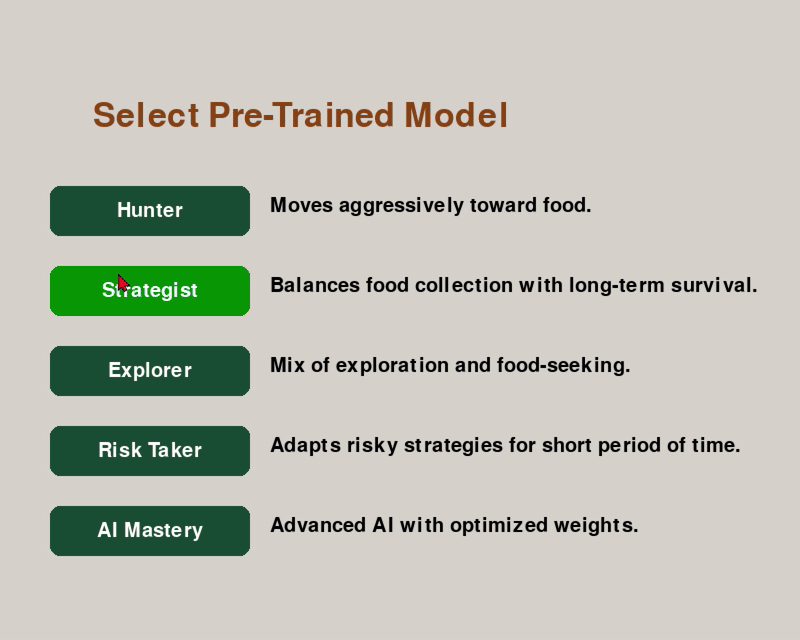

# 🐍 Snake Gen - AI-Driven Evolutionary Snake Game

## **Overview**
Snake Gen v11.5 is an **AI-powered Snake game** using **Genetic Algorithms** to train AI for **optimal survival and food collection strategies**. The game offers:
- **Manual Play** 🕹️ - Classic Snake gameplay with user control.
- **AI Training Mode** 🤖 - AI evolves over generations using machine learning principles.
- **Pre-Trained AI Mode** 🧠 - Select optimized AI models with unique strategies.

The project utilizes **`pygame`** for rendering, **`numpy`** for AI calculations, and a **genetic algorithm** to drive the AI's learning process.

---

## **Introduction**
Welcome to **AI Snake**, where you can either **train an AI** to play Snake or take control yourself!  
Using **evolutionary principles**, the AI learns **optimal movement strategies**, balancing **exploration and efficiency**.  
This project was developed to demonstrate **machine learning in a game-based environment**.

---

## **📌 Game Modes**
### **1️⃣ Manual Play**
- Control the snake using **arrow keys**.
- **Avoid collisions** while eating food to grow longer.
- **Goal:** Survive as long as possible!

<div align="center">
  
</div>

## 📌 Controls
| **Action**      | **Key**        |
|---------------|--------------|
| Move Up       | ⬆️ Arrow Key  |
| Move Down     | ⬇️ Arrow Key  |
| Move Left     | ⬅️ Arrow Key  |
| Move Right    | ➡️ Arrow Key  |
| Select Option | 🖱️ Mouse Click |

---

### **2️⃣ AI Training Mode**
- Train an AI using **Genetic Algorithms** 🧬.
- **Customizable Training** → Set the **number of snakes & generations** before training starts.
- **Goal:** AI learns to optimize **food collection & survival**.

#### **📌 Key AI Behavior Influencers**
| **Factor** | **Effect on AI Decision** |
|-----------|-------------------------|
| **Food Bonus** | Encourages the AI to seek food aggressively. |
| **Loop Penalty** | Prevents the AI from getting stuck in repetitive movements. |
| **Wall Penalty** | Discourages movement near walls unless food is close. |
| **Momentum Bonus** | Encourages smoother movement instead of abrupt turns. |
| **Exploration Bonus** | Makes the AI explore new paths to avoid getting trapped. |
| **Lookahead Depth** | Allows the AI to **predict future moves** and avoid bad decisions. |

#### **Evolution of AI Learning**
Through **genetic evolution**, the AI improves significantly over time. Here’s how performance evolved across training generations:

| **Generation** | **Avg. Length** | **Best Length** |
|--------------|--------------|--------------|
| **1**       | `6`          | `12`          |
| **10**      | `34`         | `72`          |
| **50**      | `44`         | `106`         |
| **100**     | `63`         | `143`         |

✔️ **The AI improves dramatically** as it **learns survival strategies** and **optimal movement patterns**.

<div align="center">
  
</div>

#### 📌 AI Training Guide
##### **Optimal Training Settings**

| **Training Type**    | **# Snakes per Gen** | **# Generations** | **Best Use Case**                |
|--------------------|-----------------|---------------|-------------------------------|
| **Quick Test**    | `10-15`          | `5-10`        | Test small changes in AI behavior. |
| **Balanced Training** | `20-30`      | `15-25`       | Good balance of speed & learning. |
| **Deep Optimization** | `40-50`      | `30-50`       | Best AI performance, longer training. |

#### **📌 Summary**
- The **AI selects moves based on a scoring system**.
- **Higher-scoring moves lead to better survival & food collection.**
- **Recursive lookahead helps the AI think ahead** and avoid bad paths.
- **The function optimizes food collection while avoiding traps.**

---

### **3️⃣ Pre-Trained AI Mode**
- Select from **pre-trained AI models** with different strategies:
  - **Hunter:** Aggressively moves toward food.
  - **Strategist:** Balances food-seeking with survival.
  - **Explorer:** Explores before committing to food.
  - **Risk-Taker:** Moves quickly but takes risks.
  - **AI-Mastery:** Advanced AI with highly optimized weights.
- **Watch different strategies in action!**

<div align="center">
  
</div>

---

## **📌 Installation**
### 1️⃣ **Clone the repository**:
   ```bash
   git clone [https://github.com/yourusername/Snake_Gen.git](https://github.com/burakkagan/Snake_Gen)
   cd Snake_Gen
```

### 2️⃣ Install dependencies:
To install the game, ensure you have Python installed on your system. Then, install the required dependencies using the `requirements.txt` file:

`pip install -r requirements.txt`

### 3️⃣ Run the game:
Once the dependencies are installed, you can run the game by executing the Snake_v11.5.py file.

`python Snake-Gen-v11.5.py`


## 📌 Features

✅ **AI Training Using Genetic Algorithms** 🧬  
✅ **Adaptive Mutation in AI Training** 🤖  
✅ **Optimized AI Models for Different Strategies** 🏆  

---

## 📝 License
Free to learn, free to play, free to fork.  
Go forth and evolve!

